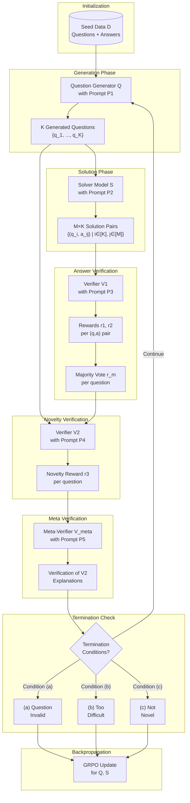

# CAQG Training Pipeline v2: Iterative Self-Evolving Question Generation

**Project Codename**: CAQG (Constraint-Aware Question Genesis)  
**Version**: 2.0  
**Date**: January 14, 2026

---

## Executive Summary

This document formalizes the iterative training pipeline for self-evolving mathematical question generation. The system comprises four core components: Question Generator ($\mathcal{Q}$), Solver ($\mathcal{S}$), Answer Verifier ($\mathcal{V}_1$), Question/Novelty Verifier ($\mathcal{V}_2$), and Meta-Verifier ($\mathcal{V}_{meta}$). Training proceeds through iterative question generation with multi-stage verification and GRPO-based optimization.

---

## 1. System Architecture

### 1.1 Component Overview

```
┌─────────────────────────────────────────────────────────────────────────────┐
│                          CAQG TRAINING SYSTEM                               │
├─────────────────────────────────────────────────────────────────────────────┤
│                                                                             │
│  ┌─────────────┐    ┌─────────────┐    ┌─────────────┐    ┌─────────────┐  │
│  │   Question  │    │   Solver    │    │  Verifier   │    │  Verifier   │  │
│  │  Generator  │    │    Model    │    │    V1       │    │    V2       │  │
│  │     Q       │    │     S       │    │  (Answer)   │    │ (Novelty)   │  │
│  └──────┬──────┘    └──────┬──────┘    └──────┬──────┘    └──────┬──────┘  │
│         │                  │                  │                  │         │
│         │    K questions   │   M solutions    │    r1, r2        │   r3    │
│         ▼                  ▼                  ▼                  ▼         │
│  ┌─────────────────────────────────────────────────────────────────────┐   │
│  │                      ITERATION CONTROLLER                           │   │
│  │  • Termination Conditions (a, b, c)                                │   │
│  │  • Reward Aggregation                                               │   │
│  │  • Backpropagation Scheduling                                       │   │
│  └─────────────────────────────────────────────────────────────────────┘   │
│                                    │                                        │
│                                    ▼                                        │
│                         ┌─────────────────┐                                │
│                         │  Meta-Verifier  │                                │
│                         │     V_meta      │                                │
│                         └─────────────────┘                                │
│                                                                             │
└─────────────────────────────────────────────────────────────────────────────┘
```

### 1.2 Data Flow Diagram



---

## 2. Formal Pipeline Specification

### 2.1 Notation

| Symbol | Description |
|--------|-------------|
| $\mathcal{D} = \{(q_i, a_i)\}_{i=1}^N$ | Seed dataset of question-answer pairs |
| $\mathcal{Q}_\theta$ | Question generator model with parameters $\theta$ |
| $\mathcal{S}_\phi$ | Solver model with parameters $\phi$ |
| $\mathcal{V}_1$ | Answer verifier (frozen or separately trained) |
| $\mathcal{V}_2$ | Novelty/difficulty verifier |
| $\mathcal{V}_{meta}$ | Meta-verifier for $\mathcal{V}_2$ explanations |
| $K$ | Number of questions generated per iteration |
| $M$ | Number of solution attempts per question |
| $I$ | Maximum iterations |
| $t$ | Majority voting threshold |
| $P_1, P_2, P_3, P_4, P_5$ | Prompts for each component |

### 2.2 Algorithm Pseudocode

```
Algorithm: CAQG Iterative Training Pipeline
─────────────────────────────────────────────

Input: 
  - Seed data D = {(q, a)}
  - Models: Q_θ, S_φ, V1, V2, V_meta
  - Hyperparameters: K, M, I, t, α, β, γ

Output:
  - Trained Q_θ*, S_φ*

Initialize:
  - iteration_rewards = []
  - all_training_data = []

FOR i = 1 TO I:
    
    # ═══════════════════════════════════════════════
    # STEP 1: Question Generation
    # ═══════════════════════════════════════════════
    
    IF i == 1:
        context ← sample(D)
    ELSE:
        context ← previous_valid_questions
    
    questions_K ← Q_θ(context, P1)  # Generate K questions
    
    # ═══════════════════════════════════════════════
    # STEP 2: Solution Generation
    # ═══════════════════════════════════════════════
    
    FOR q_k IN questions_K:
        solutions_M[q_k] ← S_φ(q_k, P2, n=M)  # M solutions per question
    
    # ═══════════════════════════════════════════════
    # STEP 3: Answer Verification (V1)
    # ═══════════════════════════════════════════════
    
    FOR q_k IN questions_K:
        FOR a_m IN solutions_M[q_k]:
            r1[q_k, a_m] ← V1(q_k, a_m, P3).solution_correct  # [0,1]
            r2[q_k, a_m] ← V1(q_k, a_m, P3).question_correct  # [0,1]
    
    # ═══════════════════════════════════════════════
    # STEP 4: Compute Group Scores
    # ═══════════════════════════════════════════════
    
    FOR q_k IN questions_K:
        # Majority voting score
        r_m[q_k] ← majority_vote(r1[q_k, :])
        
        # Solution length differential
        len_diff[q_k] ← avg_length(solutions_M[q_k]) - avg_length(solutions_M[q_{k-1}])
        
        # Aggregated question validity
        question_valid[q_k] ← mean(r2[q_k, :]) > 0.5
    
    # ═══════════════════════════════════════════════
    # STEP 5: Filter Valid Questions
    # ═══════════════════════════════════════════════
    
    valid_questions ← {q_k : question_valid[q_k] AND r_m[q_k] > t}
    
    # ═══════════════════════════════════════════════
    # STEP 6: Novelty/Difficulty Verification (V2)
    # ═══════════════════════════════════════════════
    
    FOR q_k IN valid_questions:
        v2_output ← V2(q_k, context, P4)
        r3_novelty[q_k] ← v2_output.novelty_score      # [0,1]
        r3_difficulty[q_k] ← v2_output.difficulty_score  # [0,1]
        r3_transform[q_k] ← v2_output.transformation_score  # [0,1]
        v2_explanation[q_k] ← v2_output.explanation
    
    # ═══════════════════════════════════════════════
    # STEP 7: Meta-Verification
    # ═══════════════════════════════════════════════
    
    FOR q_k IN valid_questions:
        meta_valid[q_k] ← V_meta(v2_explanation[q_k], q_k, context, P5)
        
        IF NOT meta_valid[q_k]:
            r3_novelty[q_k] ← 0  # Penalize unverified high scores
    
    # ═══════════════════════════════════════════════
    # STEP 8: Termination Check
    # ═══════════════════════════════════════════════
    
    # Condition (a): Question invalid
    IF |valid_questions| < K/2:
        RECORD iteration_rewards, BREAK
    
    # Condition (b): Too difficult
    IF mean(r_m[valid_questions]) < t:
        RECORD iteration_rewards, BREAK
    
    # Condition (c): Not novel
    IF mean(r3_novelty[valid_questions]) < novelty_threshold:
        RECORD iteration_rewards, BREAK
    
    # ═══════════════════════════════════════════════
    # STEP 9: Record and Continue
    # ═══════════════════════════════════════════════
    
    iteration_rewards[i] ← aggregate_rewards(r1, r2, r3, r_m)
    all_training_data ← all_training_data ∪ (valid_questions, solutions_M)
    context ← valid_questions  # For next iteration

END FOR

# ═══════════════════════════════════════════════════════
# BACKPROPAGATION PHASE
# ═══════════════════════════════════════════════════════

# Question Generator Update
R_Q ← compute_question_reward(iteration_rewards)
θ* ← GRPO_update(Q_θ, R_Q)

# Solver Update (Coupled or Decoupled)
IF coupled_training:
    training_data_S ← data_before_threshold_break
ELSE:
    training_data_S ← all_threshold_breaking_questions
    
φ* ← GRPO_update(S_φ, training_data_S)

RETURN Q_θ*, S_φ*
```

---

## 3. Prompt Specifications

### 3.1 Prompt P1: Question Generator

```
SYSTEM PROMPT (P1):
═══════════════════════════════════════════════════════════════════════════════

You are an expert mathematical problem designer specializing in creating novel, 
challenging questions through systematic constraint manipulation.

TASK: Given a seed mathematical problem, generate a NEW problem by applying 
one or more of the following transformations:

TRANSFORMATION TAXONOMY:
─────────────────────────
Level 1 - Local Perturbations:
  • TIGHTEN: Restrict a constraint (e.g., x > 0 → x > 1)
  • RELAX: Loosen a constraint (e.g., n ∈ Z → n ∈ Q)  
  • BOUNDARY: Push to edge case (e.g., x ≤ n → x = n)
  • NEGATE: Flip a condition (e.g., "exists" → "for all")

Level 2 - Compositional:
  • MERGE: Combine constraints (e.g., {x > 0, y > 0} → xy > 0)
  • SPLIT: Decompose constraints into interdependent parts
  • CHAIN: Create dependency between independent constraints

Level 3 - Structural:
  • INVERT: Change question type ("solve" → "find conditions for existence")
  • GENERALIZE: Specific instance → parametric family
  • SPECIALIZE: General → specific edge case
  • DOMAIN_SHIFT: Change mathematical domain while preserving structure

REQUIREMENTS:
─────────────
1. The generated question MUST be well-posed (has a definite answer)
2. The question MUST be solvable using standard mathematical techniques
3. The question MUST be meaningfully different from the seed question
4. You MUST explicitly state which transformation(s) you applied

OUTPUT FORMAT:
──────────────
<transformation>
[List the transformation(s) applied with brief justification]
</transformation>

<question>
[The complete, self-contained problem statement]
</question>

<answer>
\boxed{[final_answer]}
</answer>

<difficulty_estimate>
[1-10 scale with justification]
</difficulty_estimate>

═══════════════════════════════════════════════════════════════════════════════

USER PROMPT (P1):
─────────────────
SEED PROBLEM:
{seed_question}

SEED ANSWER:
{seed_answer}

PREVIOUS QUESTIONS IN THIS CHAIN (if any):
{previous_questions}

Generate a novel mathematical problem by transforming the seed problem.
Aim for difficulty level: {target_difficulty}/10
```

### 3.2 Prompt P2: Solver

```
SYSTEM PROMPT (P2):
═══════════════════════════════════════════════════════════════════════════════

You are an expert mathematical problem solver. Your task is to solve the given 
problem with rigorous step-by-step reasoning.

METHODOLOGY:
────────────
1. UNDERSTAND: Parse the problem, identify knowns, unknowns, and constraints
2. STRATEGIZE: Select appropriate techniques and theorems
3. EXECUTE: Apply the strategy with careful algebraic manipulation
4. VERIFY: Check the solution satisfies all constraints
5. CONCLUDE: State the final answer clearly

REQUIREMENTS:
─────────────
• Show ALL intermediate steps
• Justify each major step with the theorem/technique used
• Handle edge cases explicitly
• If multiple solutions exist, enumerate all of them
• If no solution exists, prove impossibility

OUTPUT FORMAT:
──────────────
<think>
[Complete step-by-step reasoning with justifications]
</think>

\boxed{[final_answer]}

═══════════════════════════════════════════════════════════════════════════════

USER PROMPT (P2):
─────────────────
PROBLEM:
{question}

Solve this problem step by step, showing all your work.
```

### 3.3 Prompt P3: Answer Verifier (V1)

```
SYSTEM PROMPT (P3):
═══════════════════════════════════════════════════════════════════════════════

You are a rigorous mathematical verifier. Your task is to evaluate BOTH the 
correctness of a proposed solution AND the validity of the question itself.

VERIFICATION CHECKLIST:
───────────────────────

FOR THE QUESTION:
□ Well-posedness: Is the question mathematically well-defined?
□ Completeness: Are all necessary conditions stated?
□ Consistency: Are the constraints mutually compatible?
□ Solvability: Does at least one solution exist?
□ Determinacy: Is the answer uniquely determined (or properly enumerable)?

FOR THE SOLUTION:
□ Correctness: Is each step mathematically valid?
□ Completeness: Are all cases considered?
□ Relevance: Does the solution address the actual question?
□ Final Answer: Is the boxed answer correct?

OUTPUT FORMAT:
──────────────
<question_analysis>
Well-posedness: [VALID/INVALID] - [explanation]
Completeness: [VALID/INVALID] - [explanation]
Consistency: [VALID/INVALID] - [explanation]
Solvability: [VALID/INVALID] - [explanation]
Determinacy: [VALID/INVALID] - [explanation]
</question_analysis>

<solution_analysis>
Step-by-step verification:
[For each major step, state CORRECT/INCORRECT with reason if incorrect]

Final answer check: [CORRECT/INCORRECT]
</solution_analysis>

<scores>
r1_solution_correct: [0.0 to 1.0]
r2_question_correct: [0.0 to 1.0]
</scores>

<explanation>
[Brief summary of the verification]
</explanation>

═══════════════════════════════════════════════════════════════════════════════

USER PROMPT (P3):
─────────────────
QUESTION:
{question}

PROPOSED SOLUTION:
{solution}

CLAIMED ANSWER:
{answer}

Verify both the question validity and solution correctness.
```

### 3.4 Prompt P4: Novelty/Difficulty Verifier (V2)

```
SYSTEM PROMPT (P4):
═══════════════════════════════════════════════════════════════════════════════

You are an expert evaluator of mathematical problem novelty and difficulty.
Your task is to assess how a generated question differs from its seed and 
whether the transformations create meaningful mathematical novelty.

EVALUATION CRITERIA:
────────────────────

NOVELTY ASSESSMENT:
• Semantic Distance: How different is the mathematical content?
• Structural Distance: How different is the problem structure?
• Technique Shift: Does solving require different techniques?
• Concept Introduction: Are new mathematical concepts involved?

DIFFICULTY ASSESSMENT:
• Computational Complexity: Number of steps required
• Conceptual Depth: Sophistication of required insights
• Technique Breadth: Number of different techniques needed
• Edge Case Handling: Presence of subtle boundary cases

TRANSFORMATION QUALITY:
• Validity: Is the transformation mathematically sound?
• Meaningfulness: Does it create genuine mathematical novelty?
• Non-triviality: Is it more than superficial rephrasing?

SCORING RUBRIC:
───────────────
0.0-0.2: Trivial/No meaningful change
0.2-0.4: Minor variation (e.g., changed numbers)
0.4-0.6: Moderate novelty (different approach needed)
0.6-0.8: Significant novelty (new concepts/techniques)
0.8-1.0: Exceptional novelty (creative mathematical extension)

OUTPUT FORMAT:
──────────────
<novelty_analysis>
Semantic Distance: [score] - [explanation]
Structural Distance: [score] - [explanation]
Technique Shift: [score] - [explanation]
Concept Introduction: [score] - [explanation]
</novelty_analysis>

<difficulty_analysis>
Computational Complexity: [1-10] - [explanation]
Conceptual Depth: [1-10] - [explanation]
Technique Breadth: [1-10] - [explanation]
Edge Case Handling: [1-10] - [explanation]
</difficulty_analysis>

<transformation_analysis>
Transformation(s) Applied: [list]
Validity: [VALID/INVALID] - [explanation]
Meaningfulness: [score] - [explanation]
</transformation_analysis>

<scores>
r3_novelty: [0.0 to 1.0]
r3_difficulty: [0.0 to 1.0]  
r3_transformation: [0.0 to 1.0]
</scores>

<detailed_explanation>
[Comprehensive explanation of scoring rationale - THIS WILL BE META-VERIFIED]
</detailed_explanation>

═══════════════════════════════════════════════════════════════════════════════

USER PROMPT (P4):
─────────────────
SEED QUESTION:
{seed_question}

GENERATED QUESTION:
{generated_question}

CLAIMED TRANSFORMATIONS:
{transformations}

SOLVER PERFORMANCE:
- Majority voting score: {r_m}
- Average solution length: {avg_length}
- Solution variance: {solution_variance}

Evaluate the novelty, difficulty, and transformation quality.
```

### 3.5 Prompt P5: Meta-Verifier

```
SYSTEM PROMPT (P5):
═══════════════════════════════════════════════════════════════════════════════

You are a meta-verifier. Your task is to verify whether the Novelty Verifier's 
(V2) explanation and scoring are justified and not exhibiting reward hacking.

REWARD HACKING INDICATORS:
──────────────────────────
• Inflated scores without substantive justification
• Vague or generic explanations
• Mismatch between explanation content and numerical scores
• Failure to identify obvious similarities to seed question
• Overlooking trivial transformations as "novel"

VERIFICATION CHECKLIST:
───────────────────────
□ Score-Explanation Alignment: Do scores match the explanation?
□ Specificity: Are concrete mathematical details cited?
□ Comparative Analysis: Is the seed-generated comparison rigorous?
□ Transformation Validation: Are claimed transformations actually present?
□ Calibration: Are scores consistent with the rubric?

OUTPUT FORMAT:
──────────────
<alignment_check>
Novelty score aligned with explanation: [YES/NO] - [reason]
Difficulty score aligned with explanation: [YES/NO] - [reason]
Transformation score aligned with explanation: [YES/NO] - [reason]
</alignment_check>

<specificity_check>
Mathematical details cited: [SUFFICIENT/INSUFFICIENT]
Examples: [list specific claims that are/aren't supported]
</specificity_check>

<reward_hacking_indicators>
[List any detected indicators or state NONE DETECTED]
</reward_hacking_indicators>

<verdict>
V2_EXPLANATION_VALID: [TRUE/FALSE]
CONFIDENCE: [0.0 to 1.0]
</verdict>

<recommended_action>
[ACCEPT / REJECT / PENALIZE_SCORE]
If PENALIZE_SCORE, suggested adjustment: [details]
</recommended_action>

═══════════════════════════════════════════════════════════════════════════════

USER PROMPT (P5):
─────────────────
SEED QUESTION:
{seed_question}

GENERATED QUESTION:
{generated_question}

V2 EXPLANATION:
{v2_explanation}

V2 SCORES:
- r3_novelty: {r3_novelty}
- r3_difficulty: {r3_difficulty}
- r3_transformation: {r3_transformation}

Verify whether V2's scoring is justified and not exhibiting reward hacking.
```

---

## 4. Reward Function Formalization

### 4.1 Per-Pair Rewards (V1)

For question $q_k$ and solution $a_m$:

$$r_1(q_k, a_m) = \mathbb{I}[\text{SolutionCorrect}(q_k, a_m)] \in \{0, 1\}$$

$$r_2(q_k, a_m) = \text{QuestionValidity}(q_k) \in [0, 1]$$

where QuestionValidity is the average of:
- Well-posedness score
- Completeness score
- Consistency score
- Solvability score
- Determinacy score

### 4.2 Per-Question Group Scores

**Majority Voting Score:**

$$r_m(q_k) = \frac{1}{M} \sum_{m=1}^{M} r_1(q_k, a_m)$$

**Question Validity (Aggregated):**

$$r_{q}(q_k) = \frac{1}{M} \sum_{m=1}^{M} r_2(q_k, a_m)$$

**Solution Length Differential:**

$$\Delta_L(q_k) = \frac{\bar{L}(q_k) - \bar{L}(q_{k-1})}{\bar{L}(q_{k-1}) + \epsilon}$$

where $\bar{L}(q) = \frac{1}{M}\sum_m \text{length}(a_m)$

### 4.3 Novelty Rewards (V2)

**Raw Novelty Score:**

$$r_3^{raw}(q_k) = \alpha_n \cdot r_{novelty} + \alpha_d \cdot r_{difficulty} + \alpha_t \cdot r_{transform}$$

where $\alpha_n + \alpha_d + \alpha_t = 1$ (configurable weights)

**Meta-Verified Novelty Score:**

$$r_3(q_k) = \begin{cases} 
r_3^{raw}(q_k) & \text{if } \mathcal{V}_{meta}(\text{explanation}) = \text{VALID} \\
\gamma \cdot r_3^{raw}(q_k) & \text{if } \mathcal{V}_{meta}(\text{explanation}) = \text{PENALIZE} \\
0 & \text{if } \mathcal{V}_{meta}(\text{explanation}) = \text{REJECT}
\end{cases}$$

where $\gamma \in (0, 1)$ is the penalty factor.

### 4.4 Iteration-Level Reward

For iteration $i$ completing at step $j \leq I$:

**Completion Reward:**

$$R_{completion}(i) = \frac{j}{I}$$

**Cumulative Verification Reward:**

$$R_{verify}(i) = \sum_{k=1}^{K \cdot j} \left[ w_1 \cdot r_m(q_k) + w_2 \cdot r_q(q_k) + w_3 \cdot r_3(q_k) \right]$$

**Total Iteration Reward:**

$$R_{iter}(i) = \lambda_c \cdot R_{completion}(i) + \lambda_v \cdot R_{verify}(i)$$

### 4.5 Question Generator Final Reward

$$R_{\mathcal{Q}} = \sum_{i=1}^{I_{final}} R_{iter}(i) + \beta \cdot \text{DiversityBonus}(\{q_k\}_{all})$$

where:

$$\text{DiversityBonus}(\mathcal{Q}) = \frac{1}{|\mathcal{Q}|^2} \sum_{q_i, q_j \in \mathcal{Q}} d_{semantic}(q_i, q_j)$$

### 4.6 GRPO Advantage Computation

For question generator with reward $R_{\mathcal{Q}}$:

$$A^{GRPO}(q) = \frac{R(q) - \mu_R}{\sigma_R + \epsilon}$$

where $\mu_R, \sigma_R$ are computed over the group of generated questions.

---

## 5. Termination Conditions (Formal)

### Condition (a): Question Invalidity

$$\text{TERMINATE}_a \iff \frac{|\{q_k : r_q(q_k) > 0.5\}|}{K} < 0.5$$

*Interpretation: More than half the generated questions are invalid.*

### Condition (b): Excessive Difficulty

$$\text{TERMINATE}_b \iff \frac{1}{|Q_{valid}|} \sum_{q \in Q_{valid}} r_m(q) < t$$

*Interpretation: Average solvability drops below threshold $t$.*

### Condition (c): Novelty Exhaustion

$$\text{TERMINATE}_c \iff \frac{1}{|Q_{valid}|} \sum_{q \in Q_{valid}} r_3(q) < t_{novelty}$$

*Interpretation: Questions are no longer meaningfully novel.*

---

## 6. Training Configurations

### 6.1 Coupled Training (Solver with Generator)

```
┌─────────────────────────────────────────────────────────────────┐
│                    COUPLED TRAINING MODE                        │
├─────────────────────────────────────────────────────────────────┤
│                                                                 │
│  Iteration i terminates at step j                              │
│           │                                                     │
│           ▼                                                     │
│  ┌─────────────────────────────────────────────────────────┐   │
│  │  Solver Training Data:                                   │   │
│  │  D_S = {(q_k, a_m) : k ∈ [1, K×(j-1)], r_m(q_k) > t}   │   │
│  │                                                          │   │
│  │  (Use data from iterations BEFORE threshold break)       │   │
│  └─────────────────────────────────────────────────────────┘   │
│           │                                                     │
│           ▼                                                     │
│  ┌─────────────────────────────────────────────────────────┐   │
│  │  GRPO Update for Solver:                                 │   │
│  │  φ* ← φ - η∇_φ L_GRPO(D_S)                              │   │
│  └─────────────────────────────────────────────────────────┘   │
│                                                                 │
└─────────────────────────────────────────────────────────────────┘
```

### 6.2 Decoupled Training (Solver Separate)

```
┌─────────────────────────────────────────────────────────────────┐
│                   DECOUPLED TRAINING MODE                       │
├─────────────────────────────────────────────────────────────────┤
│                                                                 │
│  After Generator Training Complete:                             │
│           │                                                     │
│           ▼                                                     │
│  ┌─────────────────────────────────────────────────────────┐   │
│  │  Generate New Questions with Trained Q_θ*                │   │
│  │  Filter: {q : r_m(q) breaks threshold t}                 │   │
│  │                                                          │   │
│  │  (Questions that are challenging but valid)              │   │
│  └─────────────────────────────────────────────────────────┘   │
│           │                                                     │
│           ▼                                                     │
│  ┌─────────────────────────────────────────────────────────┐   │
│  │  Solver Training Data:                                   │   │
│  │  D_S = {(q, a*) : q ∈ threshold_breaking_questions}     │   │
│  │                                                          │   │
│  │  where a* = best solution from M attempts               │   │
│  └─────────────────────────────────────────────────────────┘   │
│           │                                                     │
│           ▼                                                     │
│  ┌─────────────────────────────────────────────────────────┐   │
│  │  GRPO Update for Solver:                                 │   │
│  │  φ* ← φ - η∇_φ L_GRPO(D_S)                              │   │
│  └─────────────────────────────────────────────────────────┘   │
│                                                                 │
└─────────────────────────────────────────────────────────────────┘
```

### 6.3 Verifier Training (Cold Start)

```
┌─────────────────────────────────────────────────────────────────┐
│                    VERIFIER TRAINING                            │
├─────────────────────────────────────────────────────────────────┤
│                                                                 │
│  V1 (Answer Verifier):                                         │
│  ─────────────────────                                         │
│  Training Data: Human-annotated (question, solution, label)    │
│  Method: Supervised fine-tuning                                │
│  Frozen during main training loop                              │
│                                                                 │
│  V2 (Novelty Verifier):                                        │
│  ─────────────────────                                         │
│  Training Data: Human-annotated novelty comparisons            │
│  Method: Supervised fine-tuning + calibration                  │
│  Frozen during main training loop                              │
│                                                                 │
│  V_meta (Meta-Verifier):                                       │
│  ─────────────────────                                         │
│  Training Data: V2 outputs + human judgments of validity       │
│  Method: Supervised fine-tuning                                │
│  Frozen during main training loop                              │
│                                                                 │
│  NOTE: Verifiers are NOT updated during coupled training       │
│        to prevent reward hacking feedback loops                │
│                                                                 │
└─────────────────────────────────────────────────────────────────┘
```

---

## 7. Hyperparameter Recommendations

| Parameter | Symbol | Recommended Range | Notes |
|-----------|--------|-------------------|-------|
| Questions per iteration | $K$ | 8-32 | Balance diversity vs. compute |
| Solutions per question | $M$ | 8-16 | Enough for reliable majority vote |
| Maximum iterations | $I$ | 5-20 | Domain-dependent |
| Solvability threshold | $t$ | 0.3-0.5 | Higher = easier questions only |
| Novelty threshold | $t_{novelty}$ | 0.4-0.6 | Lower = more permissive |
| Novelty weight | $\alpha_n$ | 0.4-0.5 | Primary objective |
| Difficulty weight | $\alpha_d$ | 0.3-0.4 | Secondary objective |
| Transform weight | $\alpha_t$ | 0.1-0.2 | Regularization |
| Meta-penalty factor | $\gamma$ | 0.3-0.5 | Penalize unverified scores |
| Completion weight | $\lambda_c$ | 0.3-0.4 | Reward iteration depth |
| Verification weight | $\lambda_v$ | 0.6-0.7 | Reward quality |
| Diversity bonus | $\beta$ | 0.1-0.2 | Prevent mode collapse |

---

## 8. Implementation Checklist

### Phase 1: Infrastructure (Week 1)
- [ ] Set up data pipeline for seed dataset $\mathcal{D}$
- [ ] Implement prompt templates P1-P5
- [ ] Create iteration controller with termination logic
- [ ] Set up logging for all rewards and metrics

### Phase 2: Verification System (Week 2)
- [ ] Train/fine-tune V1 (Answer Verifier) on cold start data
- [ ] Train/fine-tune V2 (Novelty Verifier) on annotated comparisons
- [ ] Train/fine-tune V_meta on V2 output validation
- [ ] Calibrate scoring scales across verifiers

### Phase 3: Core Loop (Weeks 3-4)
- [ ] Implement question generation with P1
- [ ] Implement solution generation with P2
- [ ] Implement full verification pipeline (V1 → V2 → V_meta)
- [ ] Implement reward aggregation functions

### Phase 4: Training Integration (Weeks 5-6)
- [ ] Integrate with verl GRPO implementation
- [ ] Implement coupled training mode
- [ ] Implement decoupled training mode
- [ ] Add entropy monitoring and collapse detection

### Phase 5: Evaluation (Weeks 7-8)
- [ ] Implement automated novelty metrics
- [ ] Set up human evaluation protocol
- [ ] Benchmark against R-Zero baseline
- [ ] Ablation studies on components

---

## 9. Risk Analysis and Mitigations

| Risk | Probability | Impact | Mitigation |
|------|-------------|--------|------------|
| V2 reward hacking despite V_meta | Medium | High | Multi-round meta-verification; human spot-checks |
| Trivial questions dominate | Medium | Medium | Increase $\alpha_d$; difficulty targeting |
| Mode collapse in Q | Medium | High | Diversity bonus; entropy regularization |
| Verifiers become bottleneck | High | Medium | Batch processing; async verification |
| Solver cannot keep up with Q | Low | High | Coupled training; dynamic threshold adjustment |
| Infinite valid iterations | Low | Low | Hard cap at $I$; diminishing returns check |

---

## 10. Comparison with v1 Plan

| Aspect | v1 (CAQG Theoretical) | v2 (This Document) |
|--------|----------------------|---------------------|
| Focus | Mathematical framework | Implementation pipeline |
| Verification | Single constructive | Multi-stage (V1, V2, V_meta) |
| Reward | Intrinsic constraint-based | Explicit multi-component |
| Training | Abstract GRPO | Coupled vs. decoupled modes |
| Termination | Implicit | Three explicit conditions |
| Prompts | Conceptual | Fully specified |
| Meta-verification | Not addressed | Central component |

---

## Appendix A: Example Trace

```
═══════════════════════════════════════════════════════════════════════════════
ITERATION 1
═══════════════════════════════════════════════════════════════════════════════

SEED (from D):
  Q: Find all positive integers n such that n² + 1 divides n! + 1.
  A: n = 1, 2, 3

───────────────────────────────────────────────────────────────────────────────
STEP 1: Question Generation (K=4)
───────────────────────────────────────────────────────────────────────────────

Q_1: [TIGHTEN] Find all positive integers n < 100 such that n² + 1 divides n! + 1.
Q_2: [GENERALIZE] Find all positive integers n such that n² + k divides n! + k 
     for some fixed k ≥ 1.
Q_3: [INVERT] For which values of k does there exist a positive integer n 
     such that n² + 1 divides n! + k?
Q_4: [DOMAIN_SHIFT] Find all primes p such that p² + 1 divides p! + 1.

───────────────────────────────────────────────────────────────────────────────
STEP 2: Solution Generation (M=8 per question)
───────────────────────────────────────────────────────────────────────────────

Q_1: 8 solutions generated, 6 agree on {1, 2, 3}
Q_2: 8 solutions generated, 5 agree on k=1 case
Q_3: 8 solutions generated, 3 agree (high variance)
Q_4: 8 solutions generated, 7 agree on {2, 3}

───────────────────────────────────────────────────────────────────────────────
STEP 3: Answer Verification (V1)
───────────────────────────────────────────────────────────────────────────────

Q_1: r_m = 0.75, r_q = 0.95 (valid, solvable)
Q_2: r_m = 0.625, r_q = 0.80 (valid, moderately hard)
Q_3: r_m = 0.375, r_q = 0.90 (valid, difficult)
Q_4: r_m = 0.875, r_q = 1.0 (valid, accessible)

───────────────────────────────────────────────────────────────────────────────
STEP 4: Filter (threshold t = 0.5)
───────────────────────────────────────────────────────────────────────────────

Valid questions: {Q_1, Q_2, Q_4}  (Q_3 excluded: r_m < t)

───────────────────────────────────────────────────────────────────────────────
STEP 5: Novelty Verification (V2)
───────────────────────────────────────────────────────────────────────────────

Q_1: r3_novelty = 0.25 (minor change - just bounded)
Q_2: r3_novelty = 0.70 (meaningful generalization)
Q_4: r3_novelty = 0.55 (domain shift, but simpler)

───────────────────────────────────────────────────────────────────────────────
STEP 6: Meta-Verification (V_meta)
───────────────────────────────────────────────────────────────────────────────

Q_1: V2 explanation VALID
Q_2: V2 explanation VALID
Q_4: V2 explanation VALID

───────────────────────────────────────────────────────────────────────────────
STEP 7: Termination Check
───────────────────────────────────────────────────────────────────────────────

(a) Question validity: 3/4 = 0.75 > 0.5 ✓
(b) Solvability: mean(r_m) = 0.75 > 0.5 ✓
(c) Novelty: mean(r3) = 0.50 > 0.4 ✓

→ CONTINUE to Iteration 2 with context = {Q_1, Q_2, Q_4}

═══════════════════════════════════════════════════════════════════════════════
```

---

## Appendix B: Mathematical Justification for Meta-Verification

The meta-verifier addresses a fundamental problem in self-evolving systems: **Goodhart's Law** applied to learned reward functions.

**Theorem (Informal)**: If $\mathcal{V}_2$ is optimized to maximize agreement with $\mathcal{V}_{meta}$, and $\mathcal{V}_{meta}$ is trained on human judgments of explanation quality, then the system approximates human-level novelty assessment without direct human involvement in the loop.

**Proof Sketch**:
1. $\mathcal{V}_2$ cannot achieve high $r_3$ without providing detailed explanations
2. $\mathcal{V}_{meta}$ penalizes explanations that don't justify scores
3. The only stable equilibrium is where $\mathcal{V}_2$ provides honest assessments
4. Deception requires $\mathcal{V}_2$ to model $\mathcal{V}_{meta}$'s judgment, which requires understanding genuine novelty

This creates a **verification game** where honest reporting is the dominant strategy.
