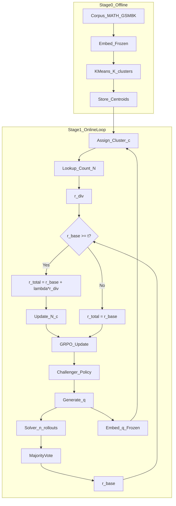

# Rentropy: Cluster-Entropy Reward to Reduce R-Zero Collapse

**Version**: 1.0  
**Date**: January 30, 2026

---

## 1. Problem Statement

R-Zero demonstrates that LLMs can self-improve via a Challenger–Solver co-evolution loop without external labeled data. However, R-Zero suffers from **entropy collapse**: over iterations the Challenger converges to a narrow distribution of tasks, evidenced by top-1 accuracy improving while top-k accuracy stagnates or degrades. The model learns to exploit a few reasoning patterns rather than acquiring diverse capabilities.

**Core question**: Can we add an intrinsic reward that explicitly maximizes task-distribution entropy to prevent this collapse?

---

## 2. Core Claim (Testable Hypothesis)

**Claim**: Relative to vanilla R-Zero (majority-vote reward only), adding a **cluster-entropy intrinsic reward** yields:

1. **Higher task-distribution entropy** over time (less mode collapse)
2. **Higher diversity of learned behaviors** (measured by top-k success and embedding diversity)
3. With **no worse** (ideally better) downstream solver performance under matched compute

**Mathematical formulation**:

$$\pi^* = \arg\max_\pi \; \mathbb{E}_{q \sim \pi}\left[r_{\text{base}}(q)\right] + \lambda \, H(p_\pi(c(q)))$$

where:
- $r_{\text{base}}(q)$ = majority-vote/self-consistency reward (R-Zero's original signal)
- $c(q) \in \{1, \dots, K\}$ = discrete cluster ID from unsupervised embedding clustering
- $H(p_\pi(c))$ = entropy of the induced cluster distribution
- $\lambda$ = diversity weight hyperparameter

---

## 3. Method Overview

### 3.1 Architecture Diagram

```
┌─────────────────────────────────────────────────────────────────────────────┐
│                         RENTROPY TRAINING LOOP                              │
├─────────────────────────────────────────────────────────────────────────────┤
│                                                                             │
│  ┌─────────────────────────────────────────────────────────────────────┐   │
│  │ STAGE 0: Build Cluster Space (Offline, Once)                        │   │
│  │                                                                      │   │
│  │   Corpus (MATH, GSM8K, etc.)                                        │   │
│  │         │                                                            │   │
│  │         ▼                                                            │   │
│  │   Embed with frozen model (Qwen3-Embedding-0.6B)                    │   │
│  │         │                                                            │   │
│  │         ▼                                                            │   │
│  │   K-Means clustering → K centroids                                  │   │
│  │         │                                                            │   │
│  │         ▼                                                            │   │
│  │   Store: {centroid_1, ..., centroid_K}                              │   │
│  └─────────────────────────────────────────────────────────────────────┘   │
│                                                                             │
│  ┌─────────────────────────────────────────────────────────────────────┐   │
│  │ STAGE 1: Online Training Loop                                        │   │
│  │                                                                      │   │
│  │   ┌──────────────┐                                                  │   │
│  │   │  Challenger  │ ───► Generate question q                         │   │
│  │   │   Policy π   │                                                  │   │
│  │   └──────────────┘                                                  │   │
│  │          │                                                          │   │
│  │          ▼                                                          │   │
│  │   ┌──────────────────────────────────────────────────────────┐     │   │
│  │   │ PARALLEL PATHS:                                           │     │   │
│  │   │                                                           │     │   │
│  │   │ PATH A: Solvability                PATH B: Diversity      │     │   │
│  │   │ ───────────────────               ──────────────────      │     │   │
│  │   │ Solver generates n rollouts       Embed q (frozen)        │     │   │
│  │   │         │                                │                │     │   │
│  │   │         ▼                                ▼                │     │   │
│  │   │ Majority vote → r_base            Assign cluster c(q)     │     │   │
│  │   │         │                                │                │     │   │
│  │   │         │                                ▼                │     │   │
│  │   │         │                         Look up N_t(c)          │     │   │
│  │   │         │                                │                │     │   │
│  │   │         │                                ▼                │     │   │
│  │   │         │                         Compute r_div           │     │   │
│  │   └─────────┴────────────────────────────────┴────────────────┘     │   │
│  │                         │                                            │   │
│  │                         ▼                                            │   │
│  │   ┌──────────────────────────────────────────────────────────┐     │   │
│  │   │ GATING + REWARD COMBINATION                               │     │   │
│  │   │                                                           │     │   │
│  │   │ IF r_base ≥ threshold:                                    │     │   │
│  │   │     r_total = r_base + λ * r_div                          │     │   │
│  │   │     Update cluster count: N_t(c) += 1                     │     │   │
│  │   │ ELSE:                                                     │     │   │
│  │   │     r_total = r_base (no diversity bonus for garbage)     │     │   │
│  │   └──────────────────────────────────────────────────────────┘     │   │
│  │                         │                                            │   │
│  │                         ▼                                            │   │
│  │   ┌──────────────────────────────────────────────────────────┐     │   │
│  │   │ GRPO UPDATE                                               │     │   │
│  │   │ Update Challenger π using r_total                         │     │   │
│  │   │ (Optionally: also update Solver on accepted questions)    │     │   │
│  │   └──────────────────────────────────────────────────────────┘     │   │
│  └─────────────────────────────────────────────────────────────────────┘   │
│                                                                             │
└─────────────────────────────────────────────────────────────────────────────┘
```

### 3.2 Flowchart (Mermaid)



---

## 4. Detailed Component Specification

### 4.1 Cluster Space Construction (Stage 0)

**Input**: External math question corpus (no labels used, only question text)

**Procedure**:
1. Collect questions from MATH, GSM8K, and similar datasets
2. Embed each question using `Qwen/Qwen3-Embedding-0.6B` (frozen)
3. Normalize embeddings to unit norm (cosine-friendly)
4. Fit K-Means with $K \in \{64, 128, 256\}$ (hyperparameter)
5. Store centroids: $\{c_1, \dots, c_K\} \subset \mathbb{R}^d$

**Cluster assignment** for any new question $q$:
$$c(q) = \arg\min_{k \in [K]} \| \text{embed}(q) - c_k \|_2$$

**Note**: This satisfies "no teacher labels" — we only use the corpus questions, not any concept annotations.

### 4.2 Base Reward (R-Zero Style)

For a generated question $q$:
1. Generate $n$ solver rollouts: $\{a_1, \dots, a_n\} \sim S(\cdot | q)$
2. Extract final answers from each rollout
3. Compute majority vote fraction:

$$r_{\text{base}}(q) = \frac{\max_a |\{i : a_i = a\}|}{n}$$

This measures **self-consistency**: high reward if rollouts agree.

**Optional ZPD band**: Accept only if $p_{\min} \le r_{\text{base}}(q) \le p_{\max}$ (e.g., 0.3–0.8).

### 4.3 Diversity Reward

Maintain a cluster visit count memory:
$$N_t(c) = \text{count of cluster } c \text{ among accepted questions up to time } t$$

**Primary formula (log-inverse-frequency)**:
$$r_{\text{div}}(q) = -\log\left(\frac{N_t(c(q)) + \alpha}{\sum_{c'} N_t(c') + \alpha K}\right)$$

where $\alpha > 0$ is a smoothing constant (e.g., 1.0).

**Intuition**: If the model uniformly visits all clusters, $p(c) = 1/K$ and $r_{\text{div}} = \log K$ for all. Rare clusters get higher reward, pushing the policy toward entropy maximization.

**Alternative (count bonus)**:
$$r_{\text{div}}(q) = \frac{1}{\sqrt{N_t(c(q)) + 1}}$$

### 4.4 Gating and Combination

**Gating rule** (prevents rewarding diverse garbage):
- Only award $r_{\text{div}}$ if $r_{\text{base}}(q) \ge t_{\text{gate}}$ (e.g., 0.5)
- Only update $N_t(c)$ for gated questions

**Combined reward**:
$$r_{\text{total}}(q) = \begin{cases}
r_{\text{base}}(q) + \lambda \cdot r_{\text{div}}(q) & \text{if } r_{\text{base}}(q) \ge t_{\text{gate}} \\
r_{\text{base}}(q) & \text{otherwise}
\end{cases}$$

**Hyperparameter $\lambda$**: Controls exploration/exploitation tradeoff. Start with $\lambda = 0.1$ and tune.

### 4.5 Optional: Within-Batch Diversity

To encourage diversity within each generation batch:
- For a batch of $B$ questions $\{q_1, \dots, q_B\}$
- Penalize repeated clusters: subtract penalty if $c(q_i) = c(q_j)$ for $i \ne j$

**Formula**:
$$r_{\text{batch}}(q_i) = r_{\text{total}}(q_i) - \beta \cdot \frac{|\{j \ne i : c(q_j) = c(q_i)\}|}{B-1}$$

### 4.6 Count Memory Stability

To reduce non-stationarity, use **exponential moving average** instead of raw counts:
$$N_{t+1}(c) = \gamma \cdot N_t(c) + (1 - \gamma) \cdot \mathbf{1}[c(q_t) = c]$$

where $\gamma \in (0.99, 0.999)$ for slow decay.

---

## 5. Experimental Design

### 5.1 Conditions (Ablation Grid)

| Condition | Base Reward | Diversity Reward | ZPD Gate | Semantic Dedup |
|-----------|-------------|------------------|----------|----------------|
| **B0** (baseline) | Majority vote | None | No | No |
| **A1** | Majority vote | Within-batch only | No | No |
| **A2** | Majority vote | Global cluster entropy | No | No |
| **A3** | Majority vote | Global cluster entropy | Yes | No |
| **A4** | Majority vote | Global cluster entropy | Yes | Yes |

**Primary comparison**: B0 vs A2 (single variable change)

### 5.2 Fixed Resources (Matched Compute)

Across all conditions, fix:
- Base model (e.g., Qwen2.5-3B-Instruct)
- Training steps / iterations
- Number of rollouts per question ($n$)
- Generation batch size
- Learning rate, optimizer settings
- Evaluation protocol and held-out sets

### 5.3 Hyperparameters to Tune

| Parameter | Description | Initial Value | Search Range |
|-----------|-------------|---------------|--------------|
| $K$ | Number of clusters | 128 | {64, 128, 256} |
| $\lambda$ | Diversity weight | 0.1 | {0.01, 0.05, 0.1, 0.2} |
| $\alpha$ | Smoothing constant | 1.0 | {0.1, 1.0, 10.0} |
| $t_{\text{gate}}$ | Gating threshold | 0.5 | {0.3, 0.5, 0.7} |
| $\gamma$ | EMA decay | 0.99 | {0.9, 0.99, 0.999} |

---

## 6. Evaluation Metrics

### 6.1 Collapse / Diversity Metrics (Primary)

| Metric | Formula / Description | Good Direction |
|--------|----------------------|----------------|
| **Cluster entropy** | $H(p_t) = -\sum_c \hat{p}_t(c) \log \hat{p}_t(c)$ | Higher = less collapse |
| **Unique clusters** | Number of distinct clusters visited in last $W$ steps | Higher |
| **Within-batch uniqueness** | Fraction of unique clusters per batch | Higher |
| **Embedding diversity** | Mean pairwise cosine distance among accepted questions | Higher |
| **Entropy trajectory slope** | $\frac{d H(p_t)}{dt}$ over training | Non-negative |

### 6.2 Quality Control Metrics

| Metric | Description | Acceptable Range |
|--------|-------------|------------------|
| **Gate pass rate** | Fraction passing $r_{\text{base}} \ge t$ | 30–70% |
| **Format success rate** | Fraction with valid boxed answer | >80% |
| **Mean question length** | Token count | Stable (no length gaming) |

### 6.3 Downstream Performance Metrics

| Metric | Description |
|--------|-------------|
| **Top-1 accuracy** | Standard accuracy on held-out benchmark |
| **Top-k accuracy** | Success if any of $k$ rollouts is correct |
| **Cluster-conditioned accuracy** | Accuracy broken down by cluster ID |
| **Accuracy spread** | Variance of per-cluster accuracies (lower = more uniform) |

### 6.4 Success Criteria

The experiment succeeds if A2 vs B0 shows:
1. **Cluster entropy**: $H(p_T^{A2}) > H(p_T^{B0})$ at final step $T$ (statistically significant)
2. **Top-k improvement**: top-k accuracy improves faster or to higher level
3. **No quality degradation**: top-1 accuracy is not worse than B0
4. **Stable gate rate**: generation quality doesn't collapse

---

## 7. Theoretical Analysis

### 7.1 Why This Should Work

**Proposition**: Under idealized conditions, if $N_t(c)$ accurately tracks the policy's induced cluster distribution $p_\pi(c)$, then maximizing $\mathbb{E}[-\log p_\pi(c(q))]$ is equivalent to maximizing the entropy $H(p_\pi)$.

**Proof sketch**: 
$$\mathbb{E}_{q \sim \pi}[-\log p_\pi(c(q))] = -\sum_c p_\pi(c) \log p_\pi(c) = H(p_\pi)$$

Thus, our reward function directly targets the entropy objective when the count estimates are accurate.

### 7.2 Failure Modes and Mitigations

| Failure Mode | Description | Mitigation |
|--------------|-------------|------------|
| **Consistency ≠ Correctness** | Majority vote can be hacked by generating questions that induce stable wrong answers | Gate + eventual evaluation on held-out with ground truth |
| **Cluster gaming** | Model generates OOD text that maps to rare clusters | Gate on $r_{\text{base}}$; monitor format/length |
| **Within-cluster collapse** | High cluster entropy but repeated templates inside each cluster | Add semantic dedup (embedding-NN); track intra-cluster diversity |
| **Non-stationary reward** | Count-based reward changes over time, causing instability | Use EMA smoothing ($\gamma$); report stability metrics |
| **Trivial solutions** | Model finds degenerate ways to spread across clusters | Inspect examples; add format/structure constraints |

---

## 8. Implementation Checklist

### Phase 1: Cluster Space Setup
- [ ] Collect corpus questions (MATH, GSM8K, etc.)
- [ ] Set up Qwen3-Embedding-0.6B inference
- [ ] Embed all questions, normalize
- [ ] Fit K-Means for $K \in \{64, 128, 256\}$
- [ ] Save centroids + cluster assignments for analysis
- [ ] Implement `assign_cluster(q)` function

### Phase 2: Reward Implementation
- [ ] Implement `ClusterCountMemory` class (raw + EMA modes)
- [ ] Implement `compute_diversity_reward(q, memory)`
- [ ] Implement gating logic
- [ ] Implement combined reward function
- [ ] Unit tests for reward computation

### Phase 3: Training Loop Integration
- [ ] Modify existing R-Zero training loop to add embedding + cluster assignment
- [ ] Add cluster count memory to training state
- [ ] Add diversity reward to total reward
- [ ] Add logging for cluster distribution / entropy metrics

### Phase 4: Baseline and Ablation Runs
- [ ] Run B0 (vanilla R-Zero) with full logging
- [ ] Run A2 (+ global cluster entropy)
- [ ] Compare metrics; proceed to A3/A4 if needed

### Phase 5: Analysis and Reporting
- [ ] Plot entropy trajectories (B0 vs A2)
- [ ] Plot unique clusters over time
- [ ] Report top-1 and top-k accuracy curves
- [ ] Cluster-conditioned accuracy breakdown
- [ ] Statistical significance tests

---

## 9. Expected Timeline

| Week | Milestone |
|------|-----------|
| 1 | Cluster space construction + centroid storage |
| 2 | Reward implementation + unit tests |
| 3 | Training loop integration + B0 baseline run |
| 4 | A2 run + preliminary analysis |
| 5 | A3/A4 ablations + final analysis |
| 6 | Write-up and figures |

---

## 10. References

1. Huang et al. (2025). **R-Zero: Self-Evolving Reasoning LLM from Zero Data**. [arXiv:2508.05004](https://arxiv.org/abs/2508.05004)
2. Bellemare et al. (2016). **Unifying Count-Based Exploration and Intrinsic Motivation**. NeurIPS.
3. Hazan et al. (2019). **Provably Efficient Maximum Entropy Exploration**. ICML.
4. Eysenbach et al. (2019). **Diversity is All You Need** (DIAYN). ICLR.

---

## Appendix A: Notation Summary

| Symbol | Meaning |
|--------|---------|
| $q$ | Generated question |
| $c(q)$ | Cluster assignment of $q$ |
| $K$ | Number of clusters |
| $N_t(c)$ | Visit count for cluster $c$ at time $t$ |
| $r_{\text{base}}$ | Base reward (majority vote) |
| $r_{\text{div}}$ | Diversity reward |
| $r_{\text{total}}$ | Combined reward |
| $\lambda$ | Diversity weight |
| $\alpha$ | Smoothing constant |
| $\gamma$ | EMA decay factor |
| $t_{\text{gate}}$ | Gating threshold |
| $H(p)$ | Entropy of distribution $p$ |
